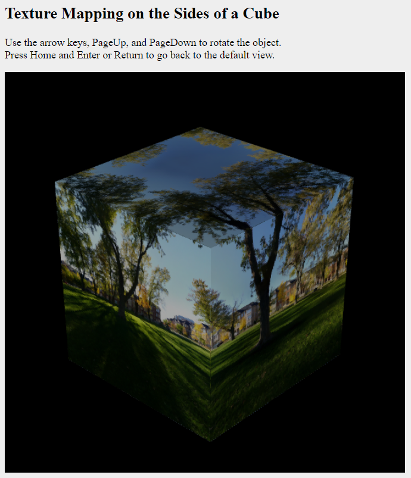
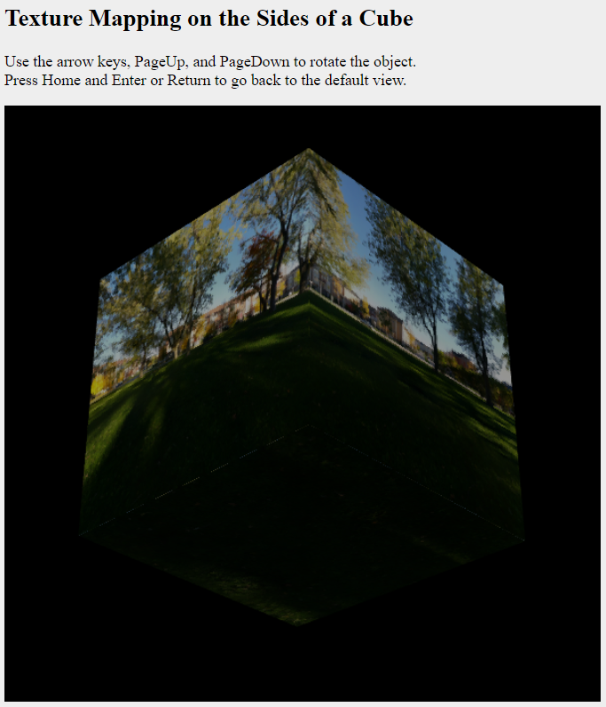

# Grafkom Texture Mapping

| NRP | Name |
| --- | --- |
| 5025211015 | Muhammad Daffa Ashdaqfillah |


## Penjelasan Pengerjaan

### 1. Mengganti img menjadi array of img
Dalam fungsi `initGL()` terdapat potongan kode berikut:
```js

    let img = [];
    for (let i = 0; i < 6; i++) {
        img[i] = new Image();
        img[i].onload = function () {
            textureObjects[i] = gl.createTexture();
            gl.bindTexture(gl.TEXTURE_2D, textureObjects[i]);
            gl.texImage2D(
                gl.TEXTURE_2D,
                0,
                gl.RGBA,
                gl.RGBA,
                gl.UNSIGNED_BYTE,
                img[i]
            );
            gl.generateMipmap(gl.TEXTURE_2D);
            if (i === 5) draw();
        };
        img[i].src = textureURLs[i];
    }
```
Pada kode diatas, saya mengubah img menjadi array of img, dan melakukan perulangan sebanyak 6 kali untuk menginisialisasi setiap img yang akan diassign ke textureObjects. Setelah textureObject diassign, maka akan dipanggil fungsi draw.

### 2. Mengubah fungsi draw
Dalam fungsi `draw()` terdapat potongan kode berikut:
```js
    drawSquare(textureObjects[0]);  // front face
    mat4.rotateY(modelview, modelview, Math.PI/2);
    drawSquare(textureObjects[1]);  // right face
    mat4.rotateY(modelview, modelview, Math.PI/2);
    drawSquare(textureObjects[2]);  // back face
    mat4.rotateY(modelview, modelview, Math.PI/2);
    drawSquare(textureObjects[3]);  // left face
    mat4.rotateY(modelview, modelview, Math.PI / 2);
    mat4.rotateX(modelview, modelview, -Math.PI/2);
    drawSquare(textureObjects[4]);  // top face
    mat4.rotateX(modelview, modelview, Math.PI);
    drawSquare(textureObjects[5]);  // bottom face
```
Pada kode diatas, saya mengubah pemanggilan fungsi drawSquare menjadi perulangan sebanyak 6 kali, dan melakukan rotasi pada modelview matrix sebelum memanggil fungsi drawSquare sesuai dengan sisi kubus yang akan digambar. Untuk sisi atas dan bawah, saya melakukan rotasi pada sumbu x sebelum memanggil fungsi drawSquare.

### 3. Hasil Pengerjaan



